# Tanikala Voting System
 [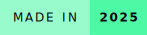](https://forthebadge.com)

   

  

A blockchain-based voting system for Bulacan State University to enhance the security, reliability, and transparency of its student government elections.

By integrating blockchain into the voting system, this project addresses the common issues found in traditional voting systems:

- **Security** – Protects voter privacy by ensuring all votes are anonymous and untraceable.

- **Reliability** – Guarantees accurate vote recording and secure storage, preventing tampering, deletion, or unauthorized modification.

- **Transparency** – Enables voters to verify that their votes were counted through transaction receipts, allowing independent verification of election results without compromising privacy.

## Developers
- [@loverinaa](https://www.github.com/loverinaa)
- [@Lowell0803](https://github.com/Lowell0803)

*This is in partial fulfillment of the requirements for the course subject **Thesis**, as part of the curriculum for fourth year students of the Bachelor of Science in Mathematics with Specialization in Computer Science.*

## Features & Contributions

| Section                  | Features                                                                                   | @Lowell0803        | @loverinaa         |
|--------------------------|--------------------------------------------------------------------------------------------|--------------------|--------------------|
| Project Management       | Task organization, coordination, and execution oversight                                  |                    | 
✔️
 |
| System Concept           | Conceptualization of System                                                               |                    | 
✔️
 |
| Designer & Graphics      | Logo design and graphical resource creation                                               |                    | 
✔️
 |
| System Quality Testing   | Visual QA, logic testing, user flow testing                                               |                    | 
✔️
 |
| Home & Static Pages      | Homepage, About, Candidates, Contact, dynamic EJS pages                                   | 
✔️
 | 
✔️
 |
| Mobile UX                | Mobile responsiveness (Home, Voting, Results pages)                                       | 
✔️
 | 
✔️
 |
| Authentication           | OTP via SendGrid, Microsoft login via Azure, Admin login UI                              | 
✔️
 | 
✔️
 |
| Admin Panel              | Dashboard, Config, Blockchain, Logs, Admin tabs & components                              | 
✔️
 | 
✔️
 |
| Voting Flow              | Vote, Review, Verify, Receipt flow                                                        | 
✔️
 | 
✔️
 |
| Results Verification     | Tally display, turnout stats, result logic & pages                                        | 
✔️
 | 
✔️
 |
| Contact System           | Contact form logic with MongoDB storage                                                   | 
✔️
 |                    |
| Candidate & Voter Data   | CRUD for candidates, tailored ballot, voter info storage/filtering                        | 
✔️
 |                    |
| System Logic             | Election config, archive/reset logic, activity logs, admin management                     | 
✔️
 |                    |
| UI Components            | Sidebar, Header, Footer, Notifications, reusable layout                                   | 
✔️
 | 
✔️
 |
| Blockchain Setup         | MetaMask, Amoy Testnet, deploy scripts, submit votes/candidates, reset, hash tracking     | 
✔️
 |                    |
| Blockchain Features      | Vote hash storage, CoinGecko API, candidate data fetching from chain                      | 
✔️
 |                    |

---

## System Screenshots

  <h3>Dynamic Homepage</h3>
  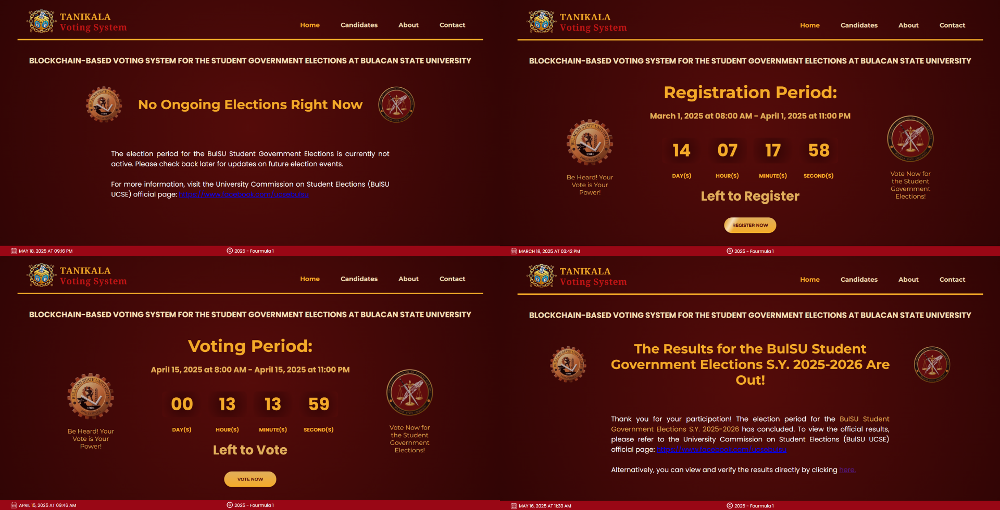
   
  <i>The homepage changes depending on the election phase   (registration, voting, double-checking, results).</i>

  <h3>Voter Registration</h3>
  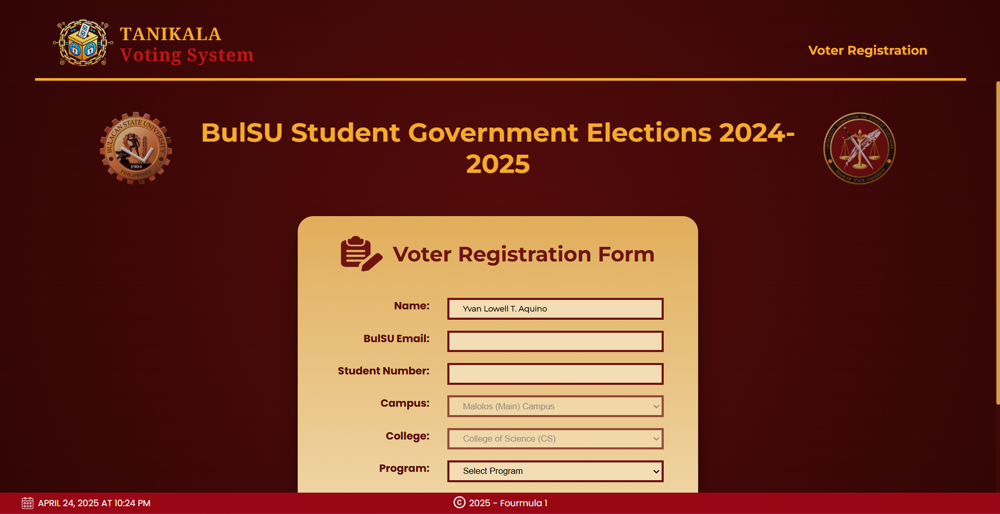
   
  <i>Only BulSU students can register via Microsoft Authentication.</i>

  <h3>Voting Interface</h3>
  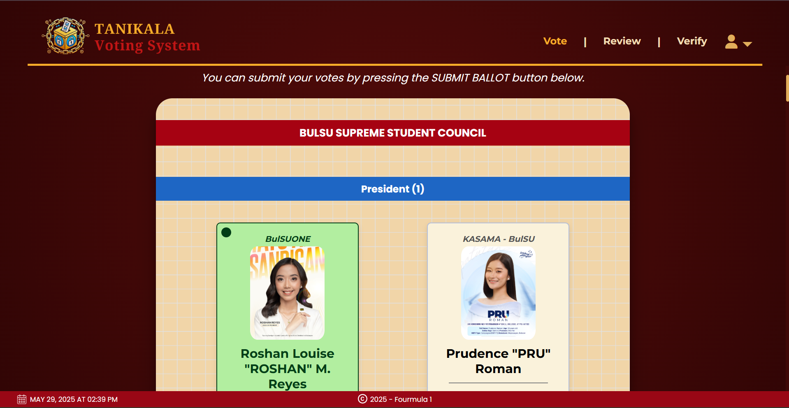
   
  <i>Tailored ballots depending on student voter's college and program.</i>

  <h3>Vote Verification</h3>
  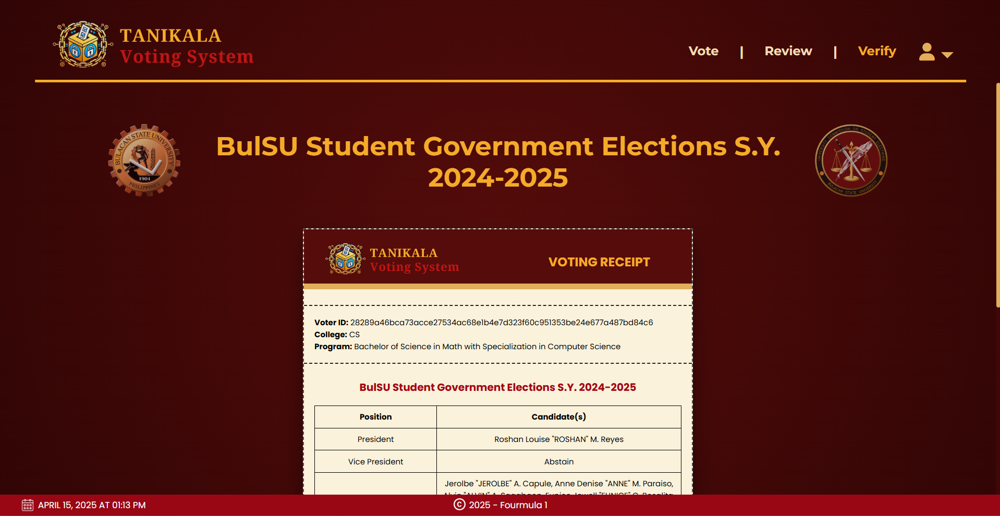
   
  <i>After voting, the voters can verify their votes along with the hashes.</i>

  <h3>Vote Receipt</h3>
  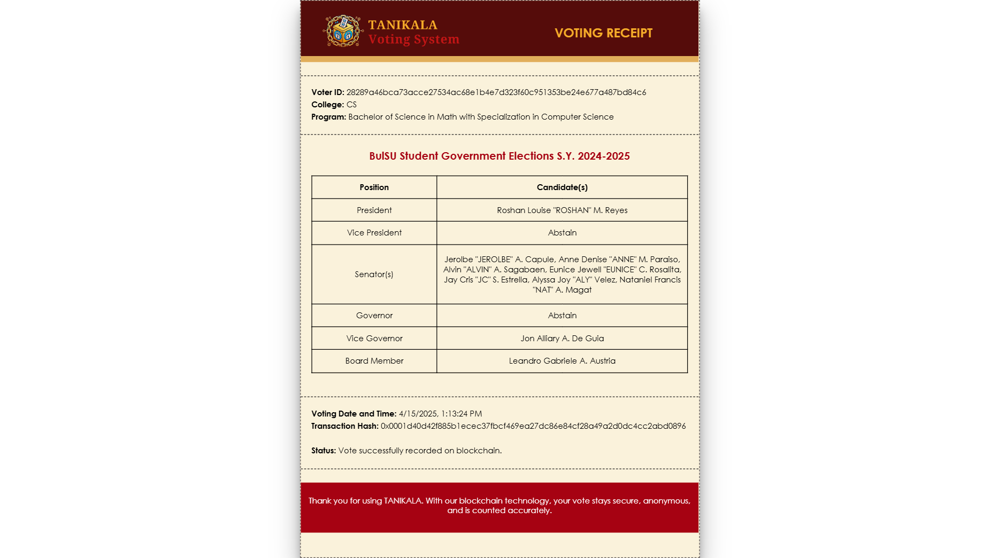
   
  <i>The receipt is downloadable.</i>

  <h3>Vote Audit</h3>
  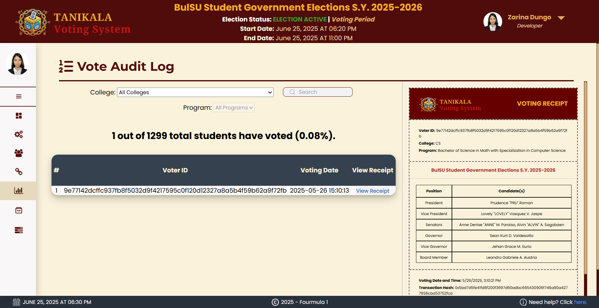
   
  <i>The votes are tracked by the admin using the Vote Audit Log.  But, they can't see the personal info of the voter, only the hashes.</i>

  <h3>Vote Tally</h3>
  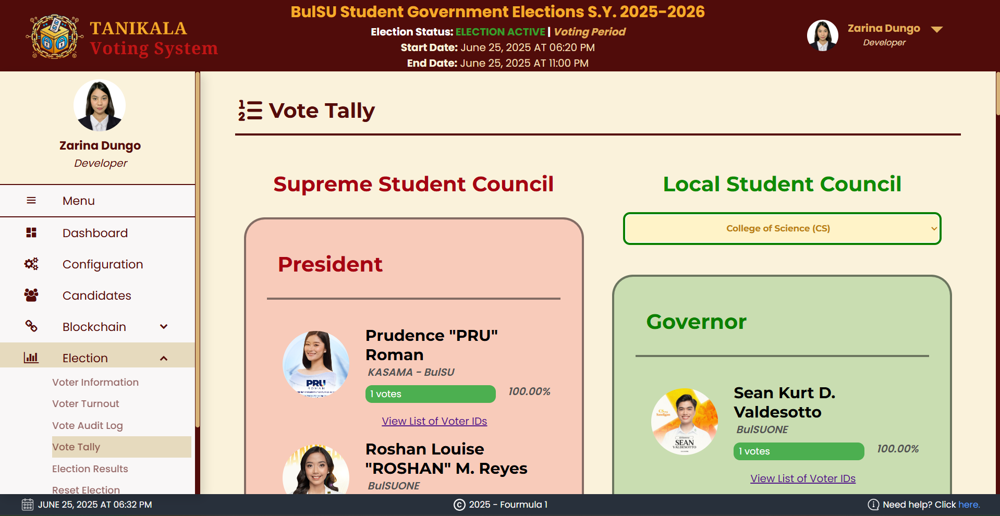
   
  <i>The vote tally is a live update of the election.</i>

  <h3>Admin Dashboard</h3>
  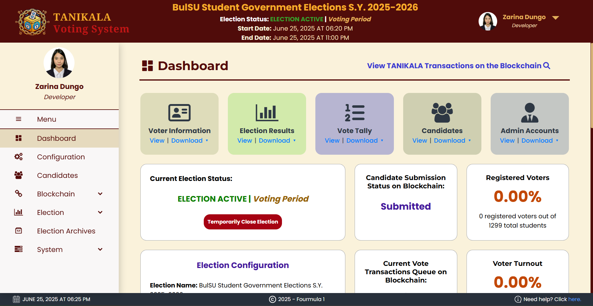
   
  <i>Overview of the election and quick actions.</i>

  <h3>Blockchain Management</h3>
  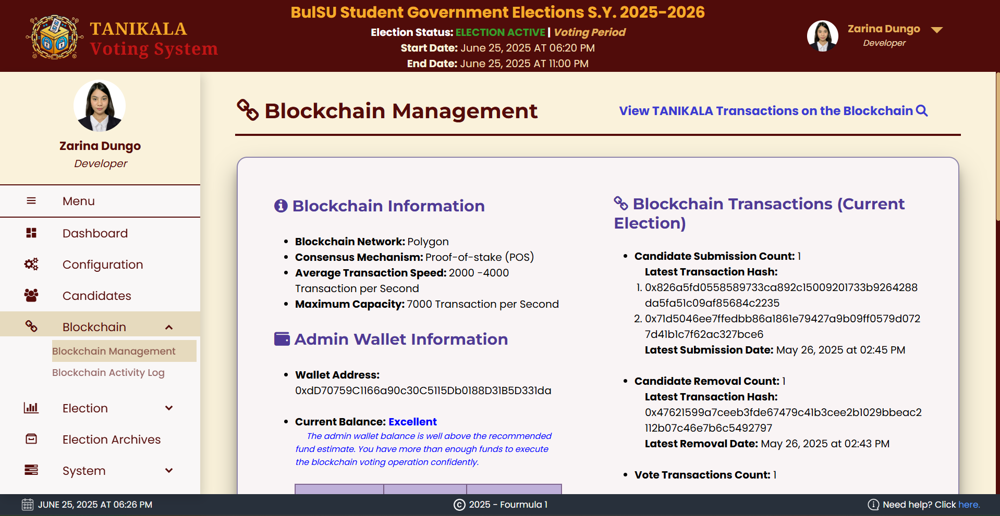
    
  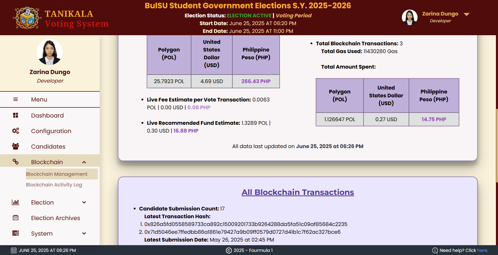
   
  <i>
    Info about the blockchain, mostly expenses.
  </i>

  <h3>Results Verification Portal - About</h3>
  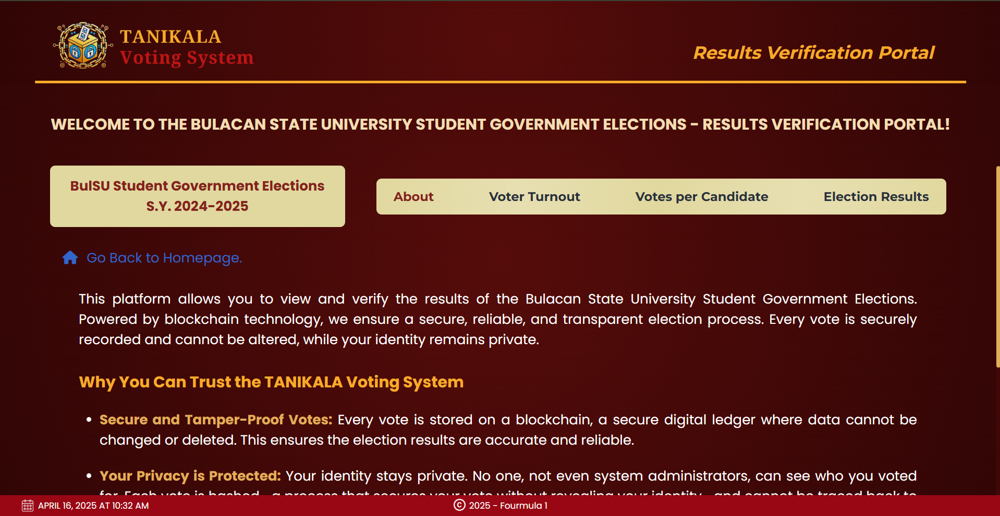
   
  <i>This portal will be available once the elections are over.</i>

  <h3>List of Voter IDs</h3>
  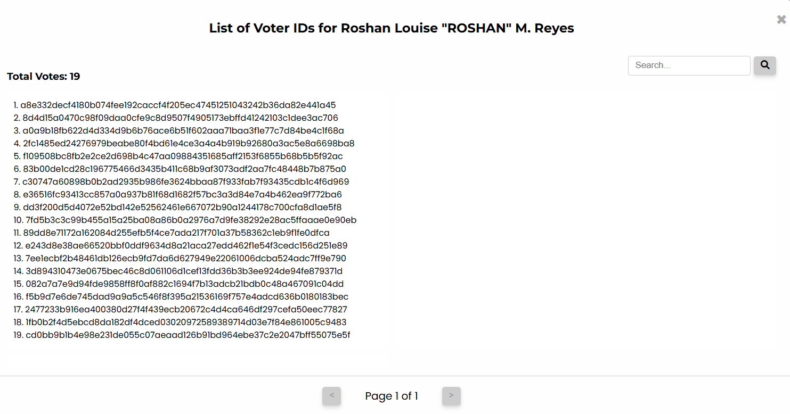
   
  <i>For each candidate, the user can search for their hash (from their receipt)  to verify if their receipt has been processed.</i>

  <h3>Results Verification Portal - Votes Per Candidate</h3>
  
   
  <i>Results and votes per candidates.</i>

 
<small>
<i><b>Disclaimer:</b> Only selected pages and tabs are shown to keep this README concise.</i>
</small>

## Acknowledgment

Special thanks to **Formula 1**, the original thesis group led by **Ms. Dungo**, who helped in the initial UI prototyping using Canva.  
They also attempted implementation and contributed code, but due to architectural misalignment and backend integration challenges, their version could not be continued.

As a result, the entire system was fully redesigned and rebuilt from scratch by **Ms. Zarina Dungo** and **Mr. Yvan Lowell Aquino**.

In general, **Mr. Aquino** handled the backend and blockchain logic, while **Ms. Dungo** focused on the frontend, UI/UX design, system testing, and project planning.

## Deployment

This website was deployed in [Render](render.com) over the duration of 2 months for the Thesis defense. But, after that, the deployment was discontinued to save costs.  

## Environment Variables

Refer to the file `.env.setup.guide` for info about the environment variables.
## FAQs

### 1. What blockchain technology did you use?
- We used Polygon, a scaling solution built on top of Ethereum. Polygon is designed to make blockchain transactions faster, cheaper, and more efficient, which makes it well-suited for voting systems.
### 2. How was the blockchain deployed in this project?
- The blockchain component was deployed on the Amoy Testnet, which is a test network used for development and experimentation.
### 3. Is this the actual repository used in the project?
- No. This is a meta repository intended for public viewing and documentation purposes only. It does not contain the complete or production-ready source code.
### 4. How can I run the full system?
- This meta repository does not include all the components necessary to run the system. If you require access to the full implementation (for academic or research purposes), please contact us at the emails below.
### 5. What files are missing from this repository?
- The key implementation files intentionally excluded from this meta repository include: `contracts/AdminCandidates.sol`, `scripts/deploy.js`, `server.js`, `hardhat.config.js`, `db.js`, and `package-lock.json`. These files contain core backend logic, blockchain integration scripts, and server configuration. If you require access for academic or research purposes, feel free to contact us via email.

## Feedback

If you have any feedback/comment/request, please reach out to us at:  

<table align="center" width="100%">
  <tr>
    <td align="center" width="50%">
       
      💌 dungo.zr@gmail.com
    </td>
    <td align="center" width="50%">
       
      💌 aquino.ylt@gmail.com
    </td>
  </tr>
</table>

Include your name, affiliation, and a clear reason for your request.

### Thank you and God bless!
